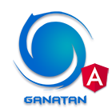

# Angular, Node.js, Java

Fullstack architecture with documented and maintainable examples.

- Angular 19 with SSR, SEO, PWA, Bootstrap  
- Node.js backends (CommonJS, ESM), Express, PostgreSQL, MySQL  
- Java 21, Spring, Spring Boot, REST APIs  
- Modular codebase with unit, integration, and e2e tests  

📚 Tutorials and guides available at [ganatan.com/tutorials](https://www.ganatan.com/tutorials)